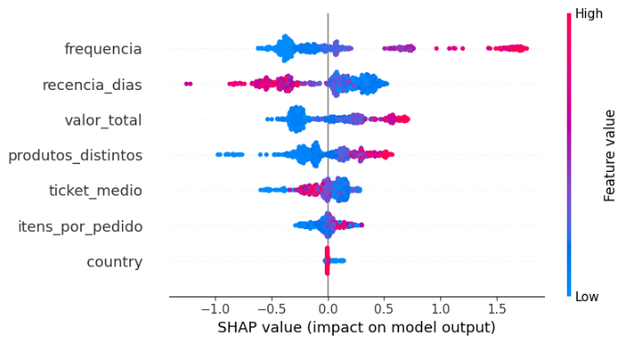

# Customer Churn Prediction — Online Retail

## Problema de Negócio

Em e-commerces e lojas de varejo, identificar quais clientes têm risco de não retornar é um dos problemas mais valiosos que ciência de dados pode resolver. Campanhas de retenção custam muito menos do que aquisição de novos clientes — mas para usá-las de forma eficiente, é preciso saber **quem** está em risco **antes** que ele vá embora.

Este projeto constrói um modelo de machine learning capaz de prever a probabilidade de recompra de cada cliente, com base no seu histórico comportamental de compras.

---

## Dataset

**Online Retail Dataset — UCI Machine Learning Repository**

Transações reais de um e-commerce do Reino Unido entre Dezembro de 2010 e Dezembro de 2011. O dataset contém pedidos, produtos, quantidades, preços e identificação dos clientes.

[Download do dataset](https://archive.ics.uci.edu/dataset/352/online+retail)

---

## Abordagem

O problema foi estruturado como uma **classificação binária com janela temporal**:

```
Janela de observação: Dezembro 2010 → Agosto 2011
Janela alvo:          Setembro 2011 → Dezembro 2011

Target: o cliente realizou alguma compra na janela alvo? (1 = sim, 0 = não)
```

Essa estrutura respeita a ordem temporal dos dados — o modelo só aprende com o passado para prever o futuro, simulando exatamente como seria usado em produção.

---

## Limpeza dos Dados

Antes da modelagem, foram aplicados os seguintes filtros:

- Remoção de registros sem `CustomerID` — compras sem identificação de cliente não permitem análise comportamental
- Remoção de faturas iniciadas com `"C"` — representam cancelamentos e devoluções
- Remoção de registros com `UnitPrice <= 0` — entradas inválidas

---

## Feature Engineering

Todas as features foram construídas usando **apenas dados da janela de observação**, evitando qualquer vazamento de dados futuros.

| Feature | Descrição | Lógica de Negócio |
|---|---|---|
| `recencia_dias` | Dias desde a última compra até o corte | Clientes que compraram há mais tempo têm menor chance de retorno |
| `frequencia` | Número de pedidos únicos realizados | Alta frequência indica engajamento com a loja |
| `ticket_medio` | Valor médio por pedido | Clientes de alto valor tendem a ser mais fiéis |
| `valor_total` | Soma total gasta no período | Indicador de importância do cliente |
| `itens_por_pedido` | Média de itens por pedido | Pedidos maiores indicam maior comprometimento |
| `produtos_distintos` | Quantidade de produtos diferentes comprados | Diversidade de compra indica maior engajamento com o catálogo |
| `country` | País do cliente (codificado numericamente) | Padrões de recompra variam por região |

---

## Modelagem

Foram testados 5 algoritmos diferentes para identificar o mais adequado para esse problema:

- LightGBM
- XGBoost
- Gradient Boosting
- Random Forest
- Logistic Regression

O **LightGBM** obteve o melhor desempenho, o que é esperado em problemas tabulares com padrões não lineares de comportamento.

### Diagnóstico e Regularização

Durante o desenvolvimento, foi identificado overfitting severo na primeira versão do modelo:

```
Versão 1:  treino 0.999  /  teste 0.693  → overfitting severo
Versão 2:  treino 0.904  /  teste 0.720  → após regularização inicial
Versão 3:  treino 0.802  /  teste 0.743  → após regularização final
```

O overfitting foi corrigido através de regularização L1/L2, limitação de profundidade das árvores e subsampling — reduzindo o gap de 0.306 para 0.059.

### Otimização de Hiperparâmetros

Após regularização manual, foi utilizado **Optuna** para busca sistemática dos melhores hiperparâmetros com 100 trials. O resultado confirmou que o modelo havia atingido seu teto para as features disponíveis — o ganho adicional foi de apenas 0.004 pontos de ROC-AUC.

### Parâmetros Finais

```python
LGBMClassifier(
    verbose=-1,
    n_estimators=300,
    learning_rate=0.03,
    max_depth=3,
    num_leaves=7,
    min_child_samples=50,
    reg_alpha=0.5,
    reg_lambda=2.0,
    subsample=0.7,
    colsample_bytree=0.7,
    random_state=42
)
```

---

## Resultados

```
ROC-AUC:  0.743
Acurácia: 0.68

              precision    recall  f1-score
Não recompra     0.61      0.60      0.61
Recompra         0.73      0.74      0.73
```

O modelo identifica corretamente 74% dos clientes com risco de churn em comparações pareadas — significativamente acima do baseline aleatório de 50%.

---

## Explicabilidade com SHAP

Para transformar o modelo numa ferramenta de negócio real, foi utilizado SHAP para explicar as previsões tanto globalmente quanto individualmente.

### Importância Global das Features



As features mais importantes para a previsão foram:

- **frequencia** — alta frequência empurra fortemente para recompra. O sinal positivo é muito mais forte que o negativo — ser um cliente frequente é o maior preditor de retorno
- **recencia_dias** — alta recência (muito tempo sem comprar) empurra para churn; baixa recência (comprou recentemente) empurra para recompra. É a feature com maior poder negativo do modelo
- **valor_total** — clientes que gastaram muito no total tendem a recomprar, embora clientes de baixo valor total tenham sinal negativo mais fraco
- **produtos_distintos** — poucos produtos distintos empurra claramente para churn. Alta diversidade não garante recompra, mas baixa diversidade é um sinal de risco

### Explicação Individual

O SHAP permite explicar por que o modelo fez cada previsão específica. Exemplo de cliente com alto risco de churn:

```
produtos_distintos = 1  → -0.76  (comprou apenas 1 produto)
recencia_dias = 195     → -0.43  (inativo há 195 dias)
ticket_medio = 76.32    → -0.39  (ticket abaixo da média)
frequencia = 1          → -0.39  (comprou apenas uma vez)
```

Isso permite ações concretas: "esse cliente tem alto risco de churn porque nunca explorou outros produtos — uma campanha com desconto em categorias novas pode ser eficaz."

---

## Como Reproduzir

1. Faça o download do dataset no link acima e salve como `Online Retail.xlsx`
2. Instale as dependências:
```bash
pip install pandas lightgbm scikit-learn shap optuna openpyxl matplotlib
```
3. Execute o notebook `churn_analysis.ipynb` na ordem das células

---

## Aprendizados Principais

- Definição correta do problema é mais importante que o algoritmo — a escolha da janela temporal e do target determina a qualidade do sinal disponível
- Overfitting identificado pelo gap entre treino e teste, não apenas pela performance no teste
- Regularização bem aplicada melhorou o ROC-AUC de teste mesmo reduzindo a performance no treino
- Otimização sistemática com Optuna confirmou que o teto do modelo estava nas features, não nos hiperparâmetros
- SHAP transforma previsões numéricas em decisões de negócio acionáveis
